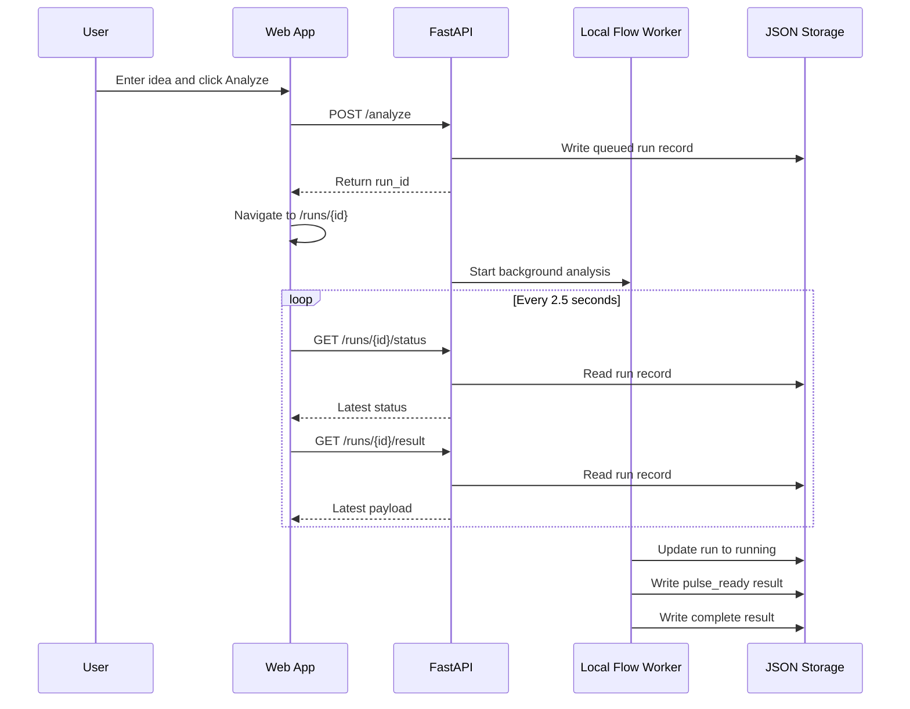

# Sequence Diagram

```mermaid
sequenceDiagram
    participant U as User
    participant W as Web App
    participant A as FastAPI
    participant F as Local Flow Worker
    participant S as JSON Storage

    U->>W: Enter idea and click Analyze
    W->>A: POST /analyze
    A->>S: Write queued run record
    A-->>W: Return run_id
    W->>W: Navigate to /runs/{id}
    A->>F: Start background analysis
    loop Every 2.5 seconds
        W->>A: GET /runs/{id}/status
        A->>S: Read run record
        A-->>W: Latest status
        W->>A: GET /runs/{id}/result
        A->>S: Read run record
        A-->>W: Latest payload
    end
    F->>S: Update run to running
    F->>S: Write pulse_ready result
    F->>S: Write complete result
```